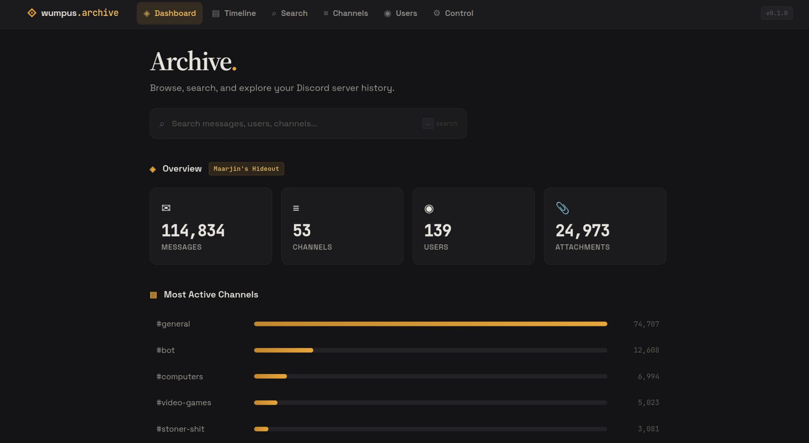

# Wumpus Archiver

Self-hosted Discord server archival with a web exploration portal.

Scrape messages, channels, users, and attachments into SQLite or PostgreSQL, then browse everything through a SvelteKit UI served by FastAPI. Supports incremental scraping, channel-level selection, and SQLite-to-PostgreSQL data transfer.



## Quick Start

### Prerequisites

- Python 3.12+
- Node.js 18+ and npm
- A [Discord bot token](https://discord.com/developers/applications) with **Message Content** and **Server Members** privileged intents, plus Read Messages and Read Message History permissions

### Setup

```bash
# 1. Create and activate a virtual environment
python3 -m venv .venv
source .venv/bin/activate      # On Windows: .venv\Scripts\activate

# 2. Install Python and Node dependencies
pip install -e ".[dev]"
cd portal && npm install && cd ..

# 3. Configure environment
cp .env.example .env
# Edit .env — set DISCORD_BOT_TOKEN and GUILD_ID
```

### Scrape & Run

```bash
# Scrape a server (uses GUILD_ID from .env, or pass --guild-id)
wumpus-archiver scrape
wumpus-archiver scrape --guild-id 123456789

# Download image attachments locally
wumpus-archiver download ./archive.db -v

# Start the web portal
wumpus-archiver serve ./archive.db -a ./attachments
```

## Running the App

> **Prerequisite**: You need an `archive.db` file before running `dev` or `serve`.
> Run `wumpus-archiver scrape` first to create one, or use an existing database.

### Development (hot-reload on both backend & frontend)

```bash
# Single command — starts FastAPI (uvicorn --reload) + Vite dev server
wumpus-archiver dev ./archive.db -a ./attachments

# Or using Make (uses archive.db by default; override with DB=path/to/file.db)
make dev
```

Backend runs on `:8000`, frontend on `:5173` with Vite HMR and API proxy.
Press Ctrl+C to stop both.

### Production

```bash
# Build the portal then serve everything from one process
wumpus-archiver serve ./archive.db --build-portal -a ./attachments

# Or build and serve separately
cd portal && npm run build && cd ..
wumpus-archiver serve ./archive.db -a ./attachments

# Using Make
make serve-build   # build + serve
make serve         # serve only (portal must already be built)
```

## CLI Reference

| Command | Description |
|---|---|
| `wumpus-archiver init` | Initialize project (creates `.env`, directories) |
| `wumpus-archiver scrape` | Scrape a Discord server (uses `GUILD_ID` from `.env`; supports incremental) |
| `wumpus-archiver download DB` | Download image attachments locally |
| `wumpus-archiver dev DB` | Start dev environment (backend + frontend, hot-reload) |
| `wumpus-archiver serve DB` | Start production server (API + built SPA) |
| `wumpus-archiver mcp DB` | Start MCP server for AI agent integration |

All commands support `--help` for full options.

## Make Targets

Run `make help` for the full list. Highlights:

| Target | Description |
|---|---|
| `make install` | Install all dependencies (Python + Node) |
| `make dev` | Start dev environment (backend + frontend with hot-reload) |
| `make build` | Build the SvelteKit portal for production |
| `make serve` | Start production server (API + built portal) |
| `make serve-build` | Build portal then start production server |
| `make lint` | Run ruff + mypy + svelte-check |
| `make format` | Auto-format Python code (ruff + black) |
| `make test` | Run Python tests |
| `make test-cov` | Run tests with coverage report |
| `make clean` | Remove build artifacts and caches |
| `make docker-build` | Build the Docker image locally |
| `make docker-up` | Start services via docker compose |
| `make docker-down` | Stop services via docker compose |
| `make mcp` | Start MCP server (stdio transport) |
| `make mcp-http` | Start MCP server (HTTP on port 9100) |

Override defaults with env vars: `DB=my.db PORT=9000 make dev`

## Project Structure

```
wumpus-archiver/
├── src/wumpus_archiver/       # Python backend
│   ├── cli.py                 # Click CLI (scrape, serve, dev, download, init)
│   ├── config.py              # Pydantic settings (.env support)
│   ├── models/                # SQLAlchemy 2.0 models (7 entities)
│   ├── storage/               # Database + repository layer
│   ├── bot/                   # Discord scraper (discord.py)
│   ├── api/                   # FastAPI app + route handlers
│   │   ├── app.py             # App factory with SPA serving
│   │   ├── schemas.py         # Pydantic response schemas
│   │   ├── scrape_manager.py  # Background scrape job manager
│   │   ├── download_manager.py # Background image download manager
│   │   ├── transfer_manager.py # SQLite→PostgreSQL data transfer
│   │   └── routes/            # Domain-split route modules (11 files)
│   ├── mcp/                   # MCP server (AI agent integration)
│   └── utils/                 # Downloader, process manager
├── portal/                    # SvelteKit frontend (adapter-static)
│   └── src/
│       ├── lib/               # API client, components, types
│       └── routes/            # Pages (home, channels, gallery, search, etc.)
├── tests/                     # pytest test suite
├── docs/                      # Architecture & planning docs
├── Dockerfile                 # Multi-stage Docker build
├── docker-compose.yml         # Docker Compose with PostgreSQL
├── .github/workflows/         # CI/CD (lint, test, Docker publish)
├── Makefile                   # Convenience targets
└── pyproject.toml             # Project metadata & dependencies
```

## Tech Stack

- **Backend**: Python 3.12 · discord.py · FastAPI · SQLAlchemy 2.0 (async) · uvicorn
- **Database**: SQLite (aiosqlite) with optional PostgreSQL (asyncpg)
- **Frontend**: SvelteKit 2 · Svelte 5 · TypeScript · Vite
- **Quality**: ruff · black · mypy · pytest · svelte-check

## API Endpoints

All endpoints are under `/api/`:

| Endpoint | Description |
|---|---|
| `GET /guilds` | List archived guilds |
| `GET /guilds/{id}` | Guild detail |
| `GET /guilds/{id}/channels` | Channel list for a guild |
| `GET /guilds/{id}/stats` | Guild statistics |
| `GET /guilds/{id}/users` | Users in a guild |
| `GET /guilds/{id}/gallery` | Image gallery for a guild |
| `GET /guilds/{id}/gallery/timeline` | Timeline-grouped gallery |
| `GET /channels/{id}/messages` | Paginated messages |
| `GET /channels/{id}/gallery` | Channel image gallery |
| `GET /search` | Full-text message search |
| `GET /users/{id}/profile` | User profile with stats |
| `GET /downloads/stats` | Local attachment download stats |
| `POST /downloads/start` | Start background image download |
| `GET /downloads/job` | Download job progress |
| `POST /downloads/cancel` | Cancel running download |
| `GET /scrape/status` | Current scrape job status |
| `POST /scrape/start` | Start a scrape job |
| `POST /scrape/cancel` | Cancel running scrape |
| `GET /scrape/history` | Scrape job history |
| `GET /scrape/guilds/{id}/channels` | Scrapeable channels for a guild |
| `GET /scrape/analyze/{id}` | Analyze channels for new messages |
| `GET /datasource` | Current data source config |
| `PUT /datasource` | Switch active data source |
| `POST /transfer/start` | Start SQLite→PostgreSQL transfer |
| `GET /transfer/status` | Transfer job progress |
| `POST /transfer/cancel` | Cancel running transfer |

## Portal Pages

| Route | Description |
|---|---|
| `/` | Dashboard with guild stats |
| `/channels` | Channel list with message counts |
| `/channel/[id]` | Message browser with gallery tab |
| `/timeline` | Timeline-grouped media feed |
| `/search` | Full-text search with filters |
| `/users` | User directory |
| `/users/[id]` | User profile page |
| `/control` | Scrape, downloads, data source & transfer management |

## Environment Variables

See `.env.example` for all options. Key variables:

| Variable | Default | Description |
|---|---|---|
| `DISCORD_BOT_TOKEN` | *(required)* | Discord bot token |
| `GUILD_ID` | *(none)* | Target Discord server ID (used as default for `--guild-id`) |
| `DATABASE_URL` | `sqlite+aiosqlite:///./wumpus_archive.db` | SQLite database connection |
| `POSTGRES_URL` | *(none)* | PostgreSQL URL (enables dual-database mode) |
| `API_HOST` | `127.0.0.1` | API bind host |
| `API_PORT` | `8000` | API bind port |
| `BATCH_SIZE` | `1000` | Messages per scrape batch |
| `RATE_LIMIT_DELAY` | `0.5` | Delay between API calls |
| `DOWNLOAD_ATTACHMENTS` | `true` | Auto-download attachments |
| `ATTACHMENTS_PATH` | `./attachments` | Local attachment storage |
| `LOG_LEVEL` | `INFO` | Logging level |

## MCP Server (AI Agent Integration)

Wumpus Archiver includes an MCP (Model Context Protocol) server that lets AI agents browse, search, and manage the archive programmatically.

### Quick Start

```bash
# stdio mode (Claude Desktop / GitHub Copilot)
wumpus-archiver mcp ./archive.db -a ./attachments

# HTTP mode (network clients / airis gateway)
wumpus-archiver mcp ./archive.db --http --port 9100 -a ./attachments
```

### Available Tools

| Tool | Description |
|------|-------------|
| `search_messages` | Full-text search across archived messages |
| `browse_messages` | Paginated message browsing in a channel |
| `get_guild_stats` | Guild statistics (channels, messages, users) |
| `get_user_profile` | User activity profile with top channels |
| `start_scrape` | Begin scraping a Discord guild |
| `cancel_scrape` | Cancel a running scrape job |
| `get_scrape_status` | Check current scrape progress |
| `download_attachments` | Trigger image attachment downloads |

### Resources

| URI | Description |
|-----|-------------|
| `archive://guilds` | List all archived guilds |
| `archive://guilds/{id}` | Guild detail with channels |
| `archive://channels/{id}/recent` | Recent messages in a channel |
| `archive://guilds/{id}/stats` | Guild statistics |
| `archive://guilds/{id}/users` | User directory |
| `archive://users/{id}/profile` | User profile |

### Client Configuration

See `mcp-config.example.json` for configuration snippets for Claude Desktop, Docker, HTTP transport, and airis gateway.

**Claude Desktop** — add to your `claude_desktop_config.json`:

```json
{
  "mcpServers": {
    "wumpus-archiver": {
      "command": "wumpus-archiver",
      "args": ["mcp", "./archive.db", "-a", "./attachments"]
    }
  }
}
```

**Docker** (stdio):

```json
{
  "mcpServers": {
    "wumpus-archiver": {
      "command": "docker",
      "args": ["run", "--rm", "-i", "-v", "./data:/data",
               "ghcr.io/junglem0nkey/wumpus-archiver:latest",
               "mcp", "/data/archive.db", "-a", "/data/attachments"]
    }
  }
}
```

## Docker

### Quick Start with Docker

```bash
# 1. Copy and edit the Docker environment file
cp .env.docker.example .env

# 2. Create data directory for persistent storage
mkdir -p data

# 3. Build and start the portal
docker compose up -d

# Portal is now at http://localhost:8000
```

### Scraping with Docker

```bash
# Scrape a Discord server (one-off command)
docker compose run --rm wumpus-archiver scrape --guild-id <GUILD_ID> -o /data/archive.db

# Download attachments locally
docker compose run --rm wumpus-archiver download /data/archive.db -o /data/attachments
```

### Building the Image Locally

```bash
make docker-build                    # Build image
make docker-up                       # Start with docker compose
make docker-down                     # Stop
```

### Volumes

The container uses `/data` for persistent storage:

| Container Path | Purpose |
|---|---|
| `/data/archive.db` | SQLite database |
| `/data/attachments/` | Downloaded image attachments |

Mount a host directory: `-v ./data:/data`

### Pre-built Images

Release images are published to GHCR on version tags:

```bash
docker pull ghcr.io/junglem0nkey/wumpus-archiver:latest
docker pull ghcr.io/junglem0nkey/wumpus-archiver:1.0.0
```

## CI/CD

- **CI** (`.github/workflows/ci.yml`): Runs lint (ruff, mypy, svelte-check) and tests on every PR and push to `main`.
- **Release** (`.github/workflows/release.yml`): On `v*.*.*` tags — runs CI checks, then builds and pushes a Docker image to GHCR.

To create a release:
```bash
git tag v1.0.0
git push origin v1.0.0
```

## Development

```bash
# Format + lint + type-check
make format && make lint

# Run tests
make test

# Run tests with coverage
make test-cov
```

## License

MIT
